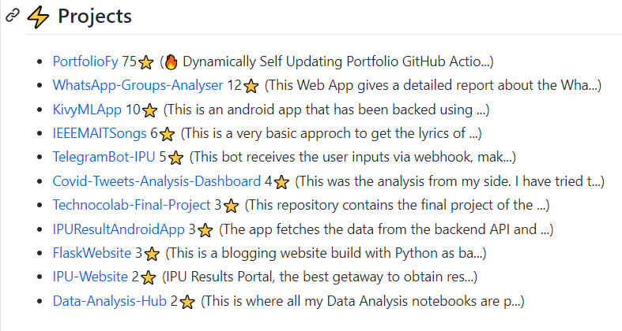

 
<p align="center">


</p>

GitHub's Profile readme is a great tool to showcase your skills and projects to potential recruiters/developers. This GitHub action allows you to update a particular section of README with your Project details. These include the project name, stars, and a controllable amount of description. 

<p align="center">

</p>

## Getting Your Profile Ready

- Add this comment in your README.md/specified file:
```
<!-- PROJECTS START -->
<!-- PROJECTS END -->
```

- The repositories need to have `project`  topic to add them to the project section.

- A GitHub personal access token will be needed which can be obtained by going to Settings > Developer Settings > Personal Access Tokens.
  <div align="center">  </div>

_Note: If you give personal repositories access then they will be added to the sections but their links will not work for others_


## Action Setup

GitHub actions can be integrated in any repository. Create a new folder called `.github/workflows/<any-name>.yml`. Paste the following starter code:

```yml
name: Update Projects
on:
  schedule:
    - cron: '0 0 * * *'
    # This makes the action to run at the end of every day. Customize this accordingly or you can also trigger this action for GitHub events (Pull, Push). Check the GitHub actions page for that.
  workflow_dispatch:
    # workflow_dispatch allows you to trigger the action any time manually

jobs:
  update-readme-with-projects:
    name: Update this repo's README with latest project updates
    runs-on: ubuntu-latest
    steps:
      - uses: actions/checkout@v2
      - uses: kaustubhgupta/readme-projects-display@master
        with:
          gh_token: ${{ secrets.TOKEN }} # Create a secret to store the access token 
```

## Available Options
_Note: The whole documentation of the action will be updated soon_

| Option         | Default Value | Description                                                                  | Required | Example |
| -------------- | ------------- | ---------------------------------------------------------------------------- | -------- | ------- |
| `gh_token`     | NA            | GitHub Personal Access token                                                 | Yes      |  NA     |
| `file_name`        | `README.md`           | Name of the readme file or any other file containing the comment mentioned above. Note: The file needs to be in root of repository. (Dynamic paths coming in next version!)                                   | No       |  myfile.txt/ myfile.html    | 
| `max_repo_description` | 50 | How much description you want to Display | No | 40 |
| `allow_forks` | True | Control if you want to display number of forks of the repository | No | False |

## Examples
- [My Workflow File](https://github.com/kaustubhgupta/kaustubhgupta/blob/master/.github/workflows/updaters.yml#L24)

**Happy?? Do Star ⭐ this Repo. 🤩**

## License

[](https://choosealicense.com/licenses/mit/)
